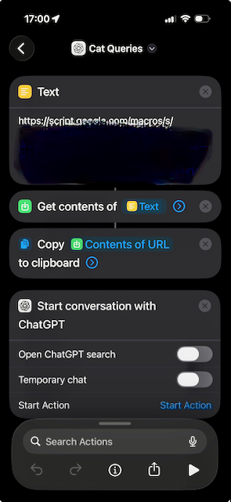

# OnlyCatEventLogger

Listens to the OnlyCat catflap Socket.IO API and appends every event to a Google Sheet (the Sheet is the source of truth). This gives you a clean, raw activity log of your cat’s comings and goings so you can see real patterns in flap use over time. The repo also includes a Google Sheets Apps Script that builds a few starter summaries (sessions, stats, contraband, cats) so you can move from raw events to quick insights without leaving the spreadsheet.

## Prerequisites
- Java 17+
- Gradle 8+ (or use a wrapper if you add one later)
- Google Cloud project with Sheets API enabled
- Service Account JSON credentials (do **not** commit); share the target Google Sheet with the service account email

## Step 1: Set up your Google Sheet
1) Create a Google Cloud project (or use an existing one) and enable the **Google Sheets API**.  
2) Create a **Service Account** and download its key:  
   - In Google Cloud Console, go to **IAM & Admin → Service Accounts**.  
   - Click **Create Service Account**, give it a name, and finish the wizard.  
   - Open the new service account, go to the **Keys** tab.  
   - Click **Add Key → Create new key → JSON**, then download the file.  
   - Store it somewhere safe (example: `~/secrets/onlycat-sa.json`).  
3) Create a new Google Sheet (or pick an existing one). Copy the **Spreadsheet ID** from the URL.  
4) Share the Sheet with the service account email (so it can append rows).  
5) Decide the **tab name** you want to write to (example: `OnlyCatEvents`).  
   - If the tab is empty, the app will write the header row for you.

## Step 2: Add your config to the project
Copy the example config file:
```bash
cp src/main/resources/application.example.yml src/main/resources/application.yml
```

Open `src/main/resources/application.yml` and fill in these fields:
```yaml
onlycat:
  token: "${ONLYCAT_TOKEN:replace-with-token}"

sheets:
  credentialsPath: "/path/to/service-account.json"
  spreadsheetId: "your-sheet-id"
  sheetName: "OnlyCatEvents"
  appendRange: "OnlyCatEvents!A1"
```

Tips:
- Prefer setting `ONLYCAT_TOKEN` as an environment variable instead of storing it in the file.
- `credentialsPath` must point to the JSON file you downloaded in step 1.
- `spreadsheetId` is the long ID in the Sheet URL.
- `sheetName` and `appendRange` must match your tab name.

Optional: Some cats can have multiple RFID chips (like mine) to merge multiple cat labels into one, edit `src/main/resources/cat-label-mapping.yml`:
```yaml
cat-label-mapping:
  aliases:
    "Cleo": "Cleo"
    "Cleo 2": "Cleo"
```

## Step 3a: Run once (foreground)
```bash
./gradlew bootRun
```
This runs in your terminal and will stop if you close the terminal or log out.
Make sure `sheets.credentialsPath` points to a real JSON file before running.

## Step 3b: Run in the background (auto-start on reboot)
This installs the app to `/Applications/OnlyCatEventLogger` and runs it at boot, even when no user is logged in.

1) Build a runnable jar:
```bash
./gradlew bootJar
```

2) Install the app to `/Applications`:
Shortcut: run the installer script to do everything automatically:
```bash
scripts/install_launchd.sh
```

If you don't want to run the script you can follow the detailed steps below.

```bash
sudo mkdir -p /Applications/OnlyCatEventLogger
sudo cp build/libs/*.jar /Applications/OnlyCatEventLogger/OnlyCatEventLogger.jar
sudo cp src/main/resources/application.yml /Applications/OnlyCatEventLogger/application.yml
```

3) Create a launchd job at `/Library/LaunchDaemons/com.onlycat.eventlogger.plist` (template in `scripts/com.onlycat.eventlogger.plist`):

Save that file, then load it:
```bash
sudo launchctl load -w /Library/LaunchDaemons/com.onlycat.eventlogger.plist
```

To stop it:
```bash
sudo launchctl unload -w /Library/LaunchDaemons/com.onlycat.eventlogger.plist
```

Notes:
- Edit `/Applications/OnlyCatEventLogger/application.yml` when you need to update config.
- Logs will appear in `/Library/Logs/OnlyCatEventLogger.out.log` and `/Library/Logs/OnlyCatEventLogger.err.log`.

## Backfill on startup (optional)
If you have a power cut or restart and want to backfill missed events, enable backfill. This uses a local checkpoint file and a read-only `getDeviceEvents` request to fetch the latest `limit` events, then only ingests events after the last checkpoint.

1) Add a backfill section to `application.yml`:
```yaml
onlycat:
  backfill:
    enabled: true
    limit: 500
    checkpointPath: "onlycat-checkpoint.json"
```

2) Restart the service. On startup it will:
   - Load the checkpoint file (if present).
   - Request the latest events per device (up to `limit`).
   - Ingest only events after the last checkpoint.
   - Update the checkpoint as rows are appended.

Notes:
- If you run from `/Applications/OnlyCatEventLogger`, the checkpoint file will live next to the jar unless you set an absolute path.
- Device IDs are auto-discovered via `getDevices` (requires `onlycat.requestDeviceListEvent` to be set).
  - This works with the background launchd service because the plist sets `WorkingDirectory` to `/Applications/OnlyCatEventLogger`.

### Bootstrapping the checkpoint from an existing Sheet
If you've already been running the service and want backfill to start from the last row in your Google Sheet, you can create the checkpoint file manually. Use the most recent `event_time_utc` (and optionally `event_id`) for each `device_id`.

Example checkpoint file (save as `onlycat-checkpoint.json` next to the jar, or set an absolute `checkpointPath`):
```json
{
  "updatedAtUtc": "2026-02-02T00:00:00Z",
  "devices": {
    "OC-DEVICE-1": { "eventTimeUtc": "2026-02-01T18:22:10Z", "eventId": 12345 },
    "OC-DEVICE-2": { "eventTimeUtc": "2026-02-01T20:03:41Z", "eventId": 67890 }
  }
}
```

Quick manual steps:
1) In the Sheet, sort or filter by `device_id`, then find the latest `event_time_utc` (and `event_id`) for each device.
2) Create/update the JSON above with those values.
3) Restart the service with backfill enabled.

## Updating the background service
If you installed the launchd service, the easiest update is to re-run the installer script:
```bash
scripts/install_launchd.sh
```

Manual update (if you prefer not to run the script):
```bash
./gradlew bootJar
sudo cp build/libs/*.jar /Applications/OnlyCatEventLogger/OnlyCatEventLogger.jar
sudo cp src/main/resources/application.yml /Applications/OnlyCatEventLogger/application.yml
sudo launchctl unload -w /Library/LaunchDaemons/com.onlycat.eventlogger.plist
sudo launchctl load -w /Library/LaunchDaemons/com.onlycat.eventlogger.plist
```

## Step 4 (optional): Add the Google Sheets Apps Script
You only need **one** Apps Script. The all-in-one script is `scripts/apps_script.gs` (summary sheets + Status tab + Web App endpoint for ChatGPT/Shortcuts).

1) In your Google Sheet, go to **Extensions → Apps Script**.  
2) Paste in **one** of the scripts above.  
3) Save, then reload the Google Sheet.  
4) You should see a new menu: **OnlyCat → Refresh stats**.

Notes:
- The script looks for a data tab with headers including:  
  `event_time_utc`, `event_trigger_source`, `event_classification`, `rfid_code`, `cat_label`
- These headers are written automatically by the app when the sheet is empty.

## Step 5 (optional): ChatGPT (AI bot) integration (Apps Script Web App + Apple Shortcut)

This step makes your cats' activities queryable with your favourite AI bot.

Use `scripts/apps_script.gs` (from Step 4) to expose a **Web App endpoint** you can call from an Apple Shortcut. The shortcut grabs a compact JSON “snapshot” (who’s in/out, recent trips, unknown visitors, contraband incidents, etc.), copies it to your clipboard, and opens ChatGPT — so you can paste once and then ask questions like a normal conversation.

Example questions you can ask ChatGPT after pasting the snapshot:
- **“How long has Cleo been outside today?”**
- **“What were Hamish’s longest trips in the last 30 days?”**
- **“Do we have any unknown visitors, and when were they last seen?”**
- **“Any contraband incidents recently?”**
- **“Are the cats going out more or less than last month?”**

Want ChatGPT to respond differently the moment you paste the snapshot? The Web App script includes a `buildChatGptPrompt(...)` helper that prepends a “system style” instruction to the returned JSON (the default asks for a friendly, short status summary first, then to wait for your question). You can tweak that function to match your vibe — for example:
- more/less verbose summaries
- “numbers-first” output
- different tone (more formal, more playful)
- extra guardrails (eg, always cite which table/field a claim came from)

Look in `scripts/apps_script.gs` for `buildChatGptPrompt` and edit the text there.

### 5a) Install the Apps Script
1) In your Google Sheet, go to **Extensions → Apps Script**.
2) Create a **new script file** (e.g. `apps_script.gs`) if you haven't already done it for step 4.
3) Paste in the contents of `scripts/apps_script.gs` from this repo.
4) Save.

Notes:
- This script is designed to **refresh the summary tabs** before returning JSON.
- If you see an error like `Cannot call SpreadsheetApp.getUi() from this context.` in the JSON, that’s expected when running as a Web App — UI calls only work when you click menu items inside the Sheet.

### 5b) Add your token (Script Properties)
The Web App uses a token as its security.

1) In Apps Script, open **Project Settings**.
2) Under **Script Properties**, add:
   - **Property**: `ONLYCAT_API_TOKEN`
   - **Value**: `<your-random-long-token>`

Tip: Use something long and unguessable (password-manager style).

### 5c) Deploy as a Web App
1) In Apps Script, click **Deploy → New deployment**.
2) Select **Web app**.
3) Set:
   - **Execute as**: **Me** (the deploying user)
   - **Who has access**: **Anyone**

Why “Anyone”? Because the token is the gatekeeper. (Treat the token like a password.)

4) Click **Deploy** and authorize permissions.
5) Copy the **Web app URL**.

When you edit the script later:
- Use **Deploy → Manage deployments → Edit** and deploy a **new version**, otherwise you’ll keep hitting the old code.

### 5d) Test the endpoint with curl
Replace `WEB_APP_URL` and `TOKEN`.

Query parameter (simple + reliable):
```bash
curl -s "WEB_APP_URL?token=TOKEN" 
```

### 5e) Apple Shortcut (simple “copy JSON → open ChatGPT”)
This is a quick, low-friction flow:

1) Create a new Shortcut (e.g. **OnlyCat → ChatGPT**).
2) Add actions in this order:
   1. **Get Contents of URL**
      - URL: `WEB_APP_URL?token=TOKEN`
      - Method: `GET`
   2. **Copy to Clipboard**
      - Input: the result of **Get Contents of URL**
   3. **Start Conversation with ChatGPT**




Usage:
- Run the Shortcut.
- When ChatGPT opens, hit **Paste**.
- ChatGPT will typically give a short “current state” summary, then you can chat normally (e.g., longest trips today, unknown visitors, contraband incidents, etc.).

### 5f) Add to Home Screen
On iPhone/iPad:
- In the Shortcuts app, open the shortcut → **Share** → **Add to Home Screen**.

### Security notes
- If you put the token in the **URL query string**, it can appear in browser history and logs. It’s fine for personal use, but treat it carefully.
- Consider rotating the token if you ever share screenshots/URLs or suspect exposure.

## Troubleshooting
- **No rows appear in the Sheet**: Confirm the app is running and connected, then check that `sheets.spreadsheetId` matches the long ID in the Sheet URL (between `/d/` and `/edit`).  
- **“Permission denied” or “The caller does not have permission”**: The Sheet must be shared with the **service account email** found inside your JSON file under `client_email`.  
- **Apps Script menu doesn’t show up**: In the Sheet, go to **Extensions → Apps Script**, save the script, then reload the Sheet tab in your browser.  
- **“Google Sheets API has not been used” error**: In Google Cloud Console, open **APIs & Services → Enabled APIs & services** and enable **Google Sheets API**.  
- **“File not found” for credentialsPath**: Double-check the absolute path and that the JSON file exists on this machine.  
- **Sheet/tab name mismatch**: `sheets.sheetName` and the tab label in the Sheet must match exactly (case-sensitive).  

## Project layout
- `src/main/java/com/onlycat/ingest` – app entrypoint and configuration
- `onlycat/onlycat` – Socket.IO client that streams events
- `onlycat/service` – event normalization + dedupe
- `onlycat/sheets` – Google Sheets appender
- `application.yml` – configuration placeholders

## Behaviour notes
- Connects to `gateway.onlycat.com` via Socket.IO with reconnection/backoff. Token is sent but never logged.  
- Registers a catch-all handler when available; otherwise listens to common event names and `message`. Logs the first two payload samples at INFO.  
- If the library does not expose a catch-all, a low-level packet interceptor captures every event name/payload and forwards it for normalization. The first 50 intercepted events log at INFO (`Packet intercept nsp=... type=... event=...`) to help verify event names; the rest log at DEBUG.  
- Forced listen-only: no outbound emits after connect. The smoke-test/subscription fields remain in config for potential future use but are inactive.  
- Each inbound event is normalized into `OnlyCatEvent` and appended to Sheets in near-real-time. Value input option is `RAW` to avoid Sheets re-formatting the JSON.  
- Dedupe: in-memory LRU (512 keys) keyed by hash(raw_json + event_time) to reduce duplicates after reconnects.  
- `raw_json` is compacted JSON and truncated to 45k characters to stay under the Google Sheets cell limit; truncation is indicated with `...(truncated)`.  
- Header columns (auto-created if the sheet is empty):
  1. ingested_at_utc  
  2. event_time_utc  
  3. event_name  
  4. event_type  
  5. event_id  
  6. event_trigger_source  
  7. event_classification  
  8. global_id  
  9. device_id  
  10. rfid_code  
  11. cat_label  

## Tests
Run `./gradlew test` to exercise the dedupe cache and event normalization samples.
